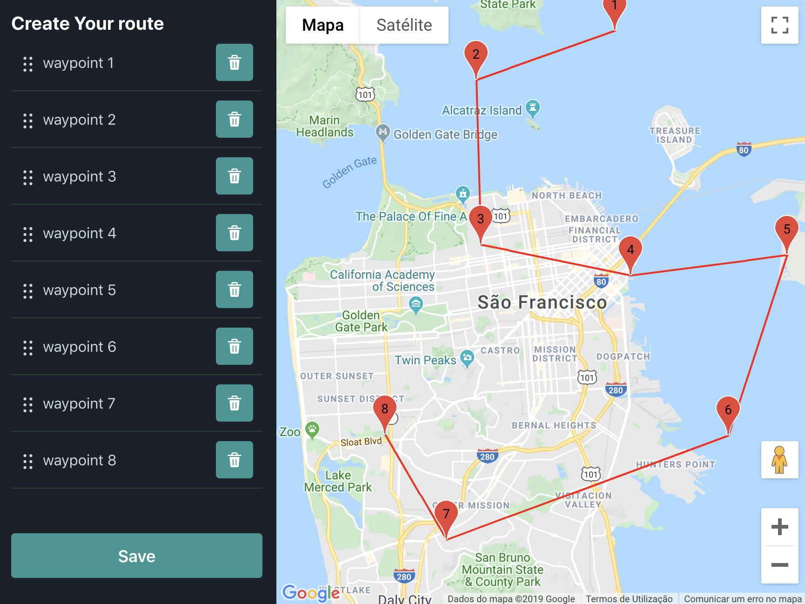

## Hello route_builder

 - [react](https://github.com/facebook/react)
 - [emotion (css-in-js)](https://emotion.sh/docs/introduction)
 - [chakra UI](https://chakra-ui.com/) for simple UI design system
 - [google-maps](https://www.ecosia.org/search?q=google%20maps%20api&addon=chrome&addonversion=2.1.0)
 - [jest](https://jestjs.io/), [enzyme](https://github.com/airbnb/enzyme) and [react-testing-library](https://testing-library.com/docs/react-testing-library/intro) for unit tests
 - [gps-to-gpx](https://www.npmjs.com/package/gps-to-gpx) for building gpx file
 - [react-sortable-hoc](https://www.npmjs.com/package/react-sortable-hoc) for sorting list UI

## Running the project

### Pre conditions
- Extract/pull files from zip/repo.
- Install dependencies `npm i`
- Create `.env.local` file with `REACT_APP_MAP_KEY` variable
- Insert a valid google maps api key

### Running local dev
- on root folder
- start local app `npm run start`
- app will run in `http://localhost:3000/`
